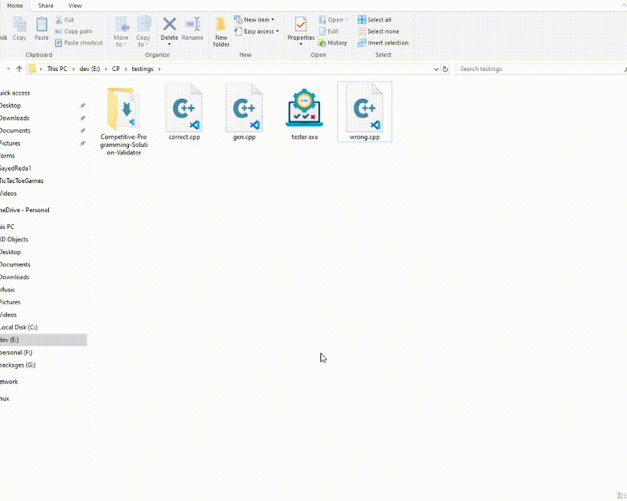

### Hi there 👋
### I'm Sayed, Passionate Cybersecurity trainee 👩‍💻 and student @ FCAI CU 👨‍🎓

## Who Am I ⁉
- I'm currently a student 👨‍🎓 at Faculty of Computers and Artifitial Intelligence Cairo University. 
- I'm also an ECPC contestent 👨‍💻 and participated in ECPC23. I've solved handreds 💯 of problems in many competitive programming platforms. 
- I've also finished many software projects including GUI and Console projects. 
- I'm currently training on my Cybersecurity Pentesting Career 🔐.
 
 

## I Can Help With:
1. C++ Projects
2. Python Projects & Automations
3. Data Structures and Algorithms
4. Problem solving
5. Linux OS
6. GUI Apps with Qt
 
 

## Recent projects:
### Machine Language Simulator
 

 

**Repo:**

 
 

### Competitive Programing Stress Tester
 

 

**Repo 🔗:** 

 
 

## Competitive Programing Stats:
 

 
 
